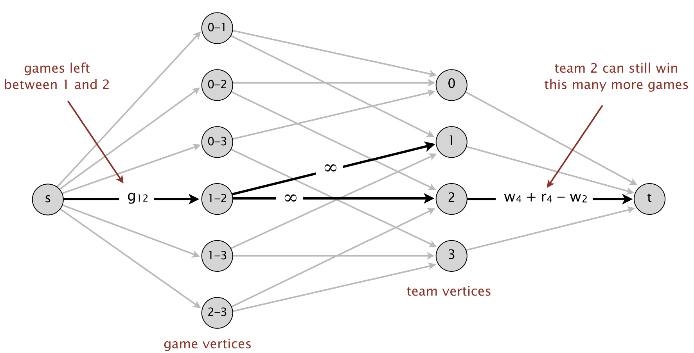

# Baseball Elimination
 In the [baseball elimination problem](https://en.wikipedia.org/wiki/Maximum_flow_problem#Baseball_elimination), there is a division consisting of <em>n</em> teams. At some point during the season, team <em>i</em> has <code>w[i]</code> wins, <code>l[i]</code> losses, <code>r[i]</code> remaining games, and <code>g[i][j]</code> games left to play against team <em>j</em>. A team is mathematically eliminated if it cannot possibly finish the season in (or tied for) first place. The goal is to determine exactly which teams are mathematically eliminated. For simplicity, we assume that no games end in a tie (as is the case in Major League Baseball) and that there are no rainouts (i.e., every scheduled game is played).

The problem is not as easy as many sports writers would have you believe, in part because the answer depends not only on the number of games won and left to play, but also on the schedule of remaining games.
# Maxflow Formulation
We now solve the baseball elimination problem by reducing it to the maxflow problem. To check whether team <em>x</em> is eliminated, we consider two cases.
* <em>Trivial elimination</em>: If the maximum number of games team <em>x</em> can win is less than the number of wins of some other team <em>i</em>, then team <em>x</em> is trivially eliminated (as is Montreal in the example above). That is, if <code>w[x] + r[x] < w[i]</code>, then team <em>x</em> is mathematically eliminated.
* <em>Nontrivial elimination</em>: Otherwise, we create a flow network and solve a maxflow problem in it. In the network, feasible integral flows correspond to outcomes of the remaining schedule. There are vertices corresponding to teams (other than team <em>x</em>) and to remaining divisional games (not involving team <em>x</em>). Intuitively, each unit of flow in the network corresponds to a remaining game. As it flows through the network from <em>s</em> to <em>t</em>, it passes from a game vertex, say between teams <em>i</em> and <em>j</em>, then through one of the team vertices <em>i</em> or <em>j</em>, classifying this game as being won by that team.
                             More precisely, the flow network includes the following edges and capacities:
  
    * We connect an artificial source vertex <em>s</em> to each game vertex <em>i-j</em> and set its capacity to <code>g[i][j]</code>. If a flow uses all <code>g[i][j]</code> units of capacity on this edge, then we interpret this as playing all of these games, with the wins distributed between the team vertices <em>i</em> and <em>j</em>.
    * We connect each game vertex <em>i-j</em> with the two opposing team vertices to ensure that one of the two teams earns a win. We do not need to restrict the amount of flow on such edges.
     * Finally, we connect each team vertex to an artificial sink vertex <em>t</em>. We want to know if there is some way of completing all the games so that team <em>x</em> ends up winning at least as many games as team <em>i</em>. Since team x can win as many as <code>w[x] + r[x]</code> games, we prevent team <em>i</em> from winning more than that many games in total, by including an edge from team vertex <em>i</em> to the sink vertex with capacity <code>w[x] + r[x] - w[i]</code>.

 

# Min-cut Subset
In fact, when a team is mathematically eliminated, there always exists such a convincing <em>certificate of elimination</em>, where <em>R</em> is some subset of the other teams in the division. Moreover, we can always find such a subset <em>R</em> by choosing the team vertices on the source side of a <em>min s-t cut</em> in the baseball elimination network. Note that although we solved a maxflow/mincut problem to find the subset R, once we have it, the argument for a team's elimination requires a little bit algebra.

To verify that we are returning a valid certificate of elimination<em> R</em>,  we should compute <em>a(R) = (w(R) + g(R)) / |R|</em>, where <em>w(R)</em> is the total number of wins of teams in <em>R</em>, <em>g(R)</em> is the total number of remaining games between teams in <em>R</em>, and <em>|R|</em> is the number of teams in <em>R</em>. Check that <em>a(R)</em> is greater than the maximum number of games the eliminated team can win.

# Conclusion
Project involves my solution to the Baseball Elimination assignment. This problem is one of the assignments given in the online algorithm course of Princeton University. My work consists of BaseballElimination.java. I've written other programs Bag.java, FlowEdge.java, FlowNetwork.java and FordFulkerson.java, inspired by the implementations of same algorithms and data-types given in <em>Algorithms, 4th Edition</em>. 

# References
* https://coursera.cs.princeton.edu/algs4/assignments/baseball/specification.php
* https://coursera.cs.princeton.edu/algs4/assignments/baseball/faq.php
* https://en.wikipedia.org/wiki/Maximum_flow_problem#Baseball_elimination
